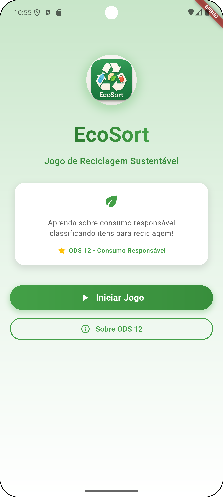
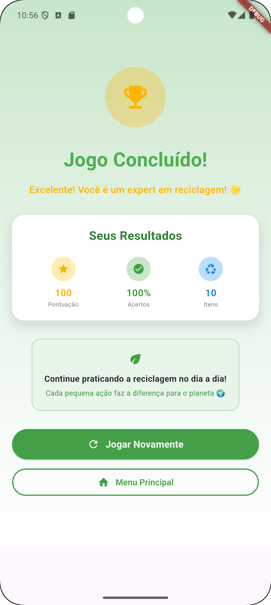

# jogo_reciclagem

A new Flutter project.


|   |  |  |
| ------------- | ------------- | ------------- |
|  |  | |


# EcoSort - Jogo de Reciclagem

Um jogo educativo Flutter que aborda o **ODS 12 - Consumo e Produção Responsável** através da classificação de itens para reciclagem.

## 📱 Sobre o Jogo

EcoSort é um jogo interativo que ensina sobre sustentabilidade e reciclagem de forma divertida. Os jogadores devem classificar diferentes itens nas categorias corretas de reciclagem:

- 🔴 **Plástico** - Garrafas PET, sacolas plásticas
- 🔵 **Papel** - Jornais, revistas, caixas
- 🟡 **Metal** - Latas de alumínio, latas de conserva
- 🟤 **Orgânico** - Restos de comida, cascas de frutas
- 🟢 **Vidro** - Garrafas de vidro, copos

## 🎯 Objetivos Educacionais

- Conscientizar sobre a importância da reciclagem
- Ensinar a classificação correta de materiais recicláveis
- Promover o consumo responsável (ODS 12)
- Desenvolver hábitos sustentáveis

## 🚀 Como Executar

### Pré-requisitos
- Flutter SDK instalado
- Dispositivo Android/iOS ou emulador

### Instalação
1. Clone ou baixe o projeto
2. Navegue até o diretório do projeto:
   ```bash
   cd jogo_reciclagem
   ```
3. Instale as dependências:
   ```bash
   flutter pub get
   ```
4. Execute o aplicativo:
   ```bash
   flutter run
   ```

## 🎮 Como Jogar

1. **Tela Inicial**: Toque em "Iniciar Jogo" para começar
2. **Classificação**: Para cada item apresentado, escolha a categoria correta de reciclagem
3. **Pontuação**: Ganhe 10 pontos para cada classificação correta
4. **Feedback**: Receba feedback imediato sobre suas escolhas
5. **Resultado Final**: Veja sua pontuação e porcentagem de acertos

## 🌟 Funcionalidades

- ✅ Interface intuitiva e responsiva
- ✅ Animações suaves e feedback visual
- ✅ Sistema de pontuação
- ✅ Feedback educativo para respostas incorretas
- ✅ Informações sobre ODS 12
- ✅ Design sustentável com cores da natureza
- ✅ Compatível com diferentes tamanhos de tela

## 🎨 Design

O jogo utiliza uma paleta de cores inspirada na natureza:
- Verde como cor principal (sustentabilidade)
- Cores específicas para cada categoria de reciclagem
- Interface limpa e moderna
- Ícones intuitivos

## 📊 Estrutura do Projeto

```
lib/
├── main.dart          # Arquivo principal com todas as telas
assets/
├── images/            # Imagens dos itens e ícones
test/
├── widget_test.dart   # Testes automatizados
```

## 🌍 Impacto Educacional

Este jogo contribui para:
- Educação ambiental
- Conscientização sobre sustentabilidade
- Promoção dos Objetivos de Desenvolvimento Sustentável (ODS)
- Formação de cidadãos mais conscientes

## 🔧 Tecnologias Utilizadas

- **Flutter** - Framework de desenvolvimento
- **Dart** - Linguagem de programação
- **Material Design** - Sistema de design
- **Animações Flutter** - Para transições suaves

## 📝 Licença

Este projeto foi desenvolvido para fins educacionais e de conscientização ambiental.

---

**Desenvolvido com 💚 para um planeta mais sustentável**
